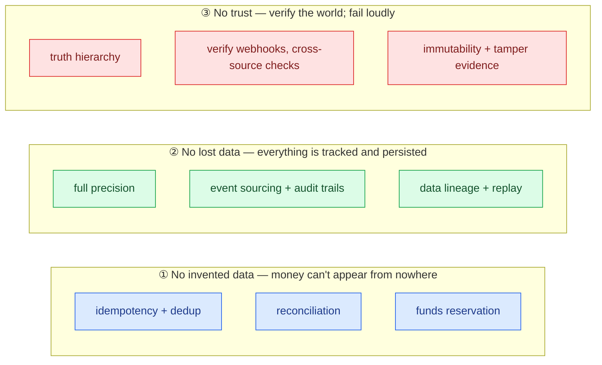
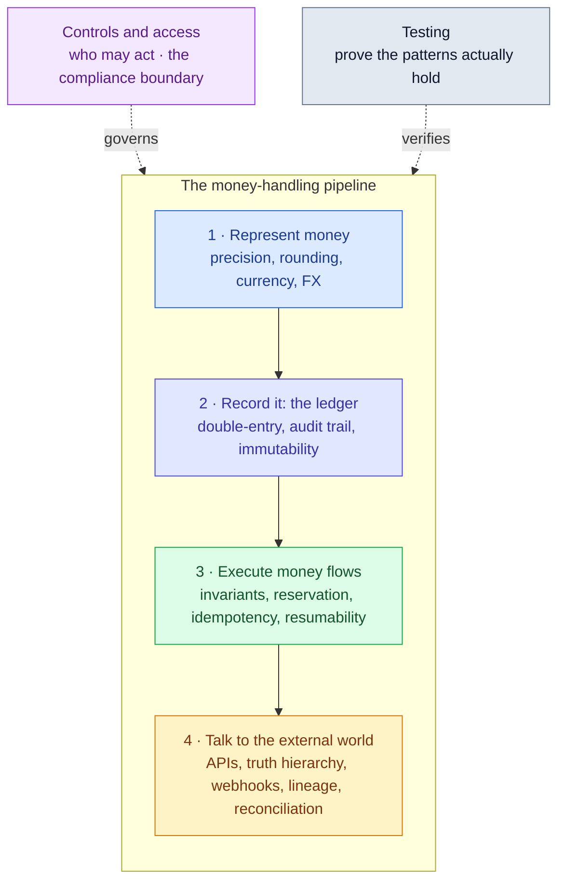
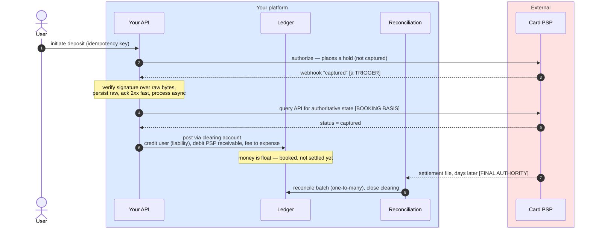
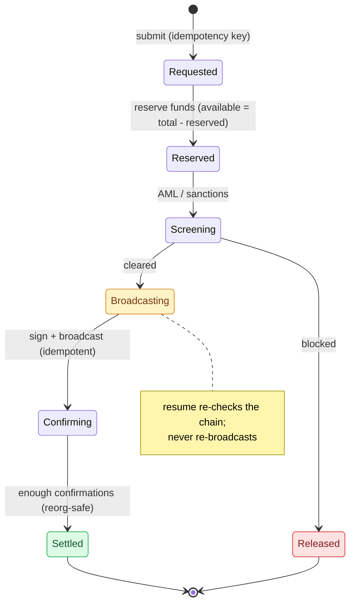

# Fintech Engineering Handbook — agent skill

A portable **agent skill** that packages the patterns and domain knowledge needed to build
software that handles money: ledgers, payments, wallets, FX, settlement, reconciliation,
custody, and the compliance controls around them.

It's plain Markdown with no platform-specific code, so it works with any AI coding agent —
[Claude Code](https://claude.com/claude-code), Codex, GitHub Copilot CLI, Gemini CLI, Cursor,
Aider — and with humans. Agents that understand the `SKILL.md` skill format load it natively;
agents that read project instructions pick it up via [`AGENTS.md`](./AGENTS.md); anything
else (or anyone) can just open `SKILL.md`. See [Install](#install) for per-platform setup.

It turns the excellent [*Fintech Engineering Handbook*](https://w.pitula.me/fintech-engineering-handbook/)
by **Voytek Pitula** into a progressively-disclosed skill so an agent reads only the layer it
needs for the task at hand.

> **Scope.** Money-movement engineering (payments, ledgers, settlement, reconciliation,
> custody balances) is first-class. Capital-markets / trading systems (market-making, order
> books, options & derivatives, fixed income, FX/rates OTC, repo/swaps) are covered only at
> an **orientation + architecture-risk** level — the skill supplies the vocabulary and flags
> the structural risks, then defers the deep design to specialists. It is not a
> capital-markets handbook.

---

## Why money software is different

In most software a dropped event or a rounding glitch is a bug. In money software it's a
*lost or invented dollar* — and it has to be explainable to an auditor years later. Every
pattern in this skill exists to uphold **three principles**. When unsure what to do, ask
which one is at risk.



The skill's habit is to **lead with the principle at risk** ("clamping a negative balance to
zero *invents* money") so feedback is concrete and traceable, not a style opinion.

---

## How the skill is organized

Money software stacks in layers: you **represent** money, **record** it, **execute** flows
over it, and **talk to the external world** — with **controls** governing who may act and
**testing** proving the patterns hold. Each layer is one reference file; the skill reads only
the one(s) a task needs.



**Progressive disclosure.** `SKILL.md` (the always-loaded entry point) holds the three
principles, the forced-output defaults, and a "which file for which task" map — under ~190
lines. The detail lives in `references/*.md` and is pulled in on demand, so the agent's
context stays small until a layer is actually in play.

| If the task is about… | Read |
| --- | --- |
| Modeling/storing/serializing an amount; precision, rounding, currencies, FX | `references/representing-money.md` |
| Recording movements so the books balance and survive audit | `references/ledger.md` |
| Keeping one operation correct: invariants, reservation, idempotency, resumability | `references/executing-money-flows.md` |
| Talking to unreliable third parties: the truth hierarchy, APIs, webhooks, lineage, reconciliation | `references/external-world.md` |
| Who may act + proving the process was followed (incl. the compliance boundary) | `references/controls-and-access.md` |
| How to gain confidence: property-based, idempotency/crash injection, golden, prod testing | `references/testing.md` |
| A finance/payments/trading/crypto/compliance **term** | `references/glossary.md` |
| Seeing the patterns combined in a realistic flow | `references/end-to-end-examples.md` |

---

## The forced-output defaults

Four behaviors the skill states up front, every time the topic comes up — they're the
highest-leverage "always do this" rules, and the most common *silent* failures:

- **Money representation.** A per-context decision (ledger / storage / API / compute /
  display). On the wire: a **string** with an explicit scale and a rounding-policy reference
  — never a bare number, never implied decimals; arbitrary-width integers for crypto.
- **The truth hierarchy.** Don't mechanically call any one channel "the source of truth."
  Identify the domain and assign each source a role: **trigger** (often a webhook) →
  **booking basis** (usually an API read) → **final reconciliation authority** (settlement
  file, bank statement, chain finality).
- **Effectively-once processing.** Exactly-once *delivery* is impossible; aim for exactly-once
  *effect* via at-least-once delivery + idempotent, resumable processing — checked against an
  eight-question review checklist.
- **The compliance boundary.** Split every recommendation into *engineerable* (the how) vs
  *not engineering's to decide alone* (retention periods, screening thresholds, what's PII,
  custody legality…), and name the owner instead of hardcoding a guess.

---

## A worked example: a card deposit

Money coming **in** is less about "don't pay twice" and more about *don't trust what the
outside world says, and don't credit money that hasn't really arrived.* This one flow ties
together the truth hierarchy, idempotency, the clearing account, and reconciliation:



The whole flow is built on *not* believing the happy-path signal: the webhook is a trigger,
not a fact; the clearing account refuses to recognize money until it has actually moved; and
reconciliation verifies the PSP against your books, not the other way around. Two more worked
flows (a crypto withdrawal and an in-app conversion) are in
[`references/end-to-end-examples.md`](./references/end-to-end-examples.md).

---

## Staying correct across crashes: a resumable withdrawal

Money *leaving* through an irreversible effect (an on-chain send) must survive dying between
any two steps. The flow is an explicit, durably-stored state machine that an independent
driver can resume — and every step is safe to re-run:



A reservation that's never resolved locks user funds, so a backstop (a sweeper or the
resumable driver) must guarantee it resolves. A resume after a crash *re-checks the chain*
rather than blindly broadcasting again — that's effectively-once in practice.

---

## What this skill adds beyond the original

Most of the text is the original handbook, reorganized. A handful of sections are the
maintainer's own extensions — informed by community discussion of the handbook — that turn
soft or absolute prose into testable, decision-oriented defaults. All are flagged in
[`NOTICE.md`](./NOTICE.md):

1. **Money representation — a per-context default stance + decision matrix** (ledger /
   storage / API transport / compute / display): amounts on the wire as strings with an
   explicit scale and a rounding-policy reference; never a bare number or implied decimals;
   arbitrary-width integers for crypto.
2. **Ledger balances are projections, not "never stored"** — a stored balance is fine if it's
   recomputable, reconcilable, explainable, and drift-detectable; what's forbidden is the
   *uncomputable* balance mutated with no entry behind it.
3. **A judgment-point sweep** — several soft or absolute calls turned into conditional
   defaults: idempotency dedup window, circuit breakers, provider redundancy, reservation
   backstop, key-reuse fingerprint, per-balance linearizability, testing defaults vs menu.
4. **Data lineage & replayability** — an 8-field provenance checklist for every external
   fact, append-only versioned facts, and replay of any report/decision against the exact
   input versions it used.
5. **The truth hierarchy** — per-source, per-role authority (trigger / booking basis / final
   reconciliation authority) with a per-domain table; "don't trust the webhook" becomes a
   role assignment, not a law.
6. **The effectively-once review checklist** — eight testable questions tying idempotency and
   resumability together, each mapped to a test (the goal is effectively-once *processing*,
   not exactly-once *delivery*).
7. **The compliance boundary** — split every recommendation into *engineerable* vs *not
   engineering's to decide alone*, with trigger surfaces and how to handle the second column.
8. **An explicit scope boundary** — money-movement engineering is first-class; capital
   markets is orientation + architecture-risk-flagging only (see the Scope note above).

---

## Structure

```
fintech-engineering-handbook/
├── SKILL.md                 # entry point: scope, 3 principles, forced-output defaults + a "which file?" map
├── AGENTS.md                # universal entry for non-SKILL.md agents (Codex, Cursor, Aider…) → routes to SKILL.md
├── references/
│   ├── representing-money.md     # precision (default stance + decision matrix), rounding, currencies, FX rates
│   ├── ledger.md                 # double-entry, balances-as-projections, timestamps, audit trails, event sourcing, immutability/GDPR
│   ├── executing-money-flows.md  # invariants, funds reservation, overdrafts, idempotency, resumability, effectively-once checklist
│   ├── external-world.md         # consuming APIs, truth hierarchy, webhooks, data lineage & replay, outbox/CDC, reconciliation
│   ├── controls-and-access.md    # compliance boundary, segregation of duties, access control, SDLC change trail
│   ├── testing.md                # property-based, invariant/idempotency injection, golden, prod testing
│   ├── glossary.md               # Appendix A: domain vocabulary (+ capital-markets orientation) + further reading
│   └── end-to-end-examples.md    # Appendix B: three worked flows
├── NOTICE.md                # attribution to the original handbook
└── README.md
```

---

## Install

The skill is plain Markdown with no dependencies. Clone it once, then point your agent at it.

```bash
git clone https://github.com/YSKM523/fintech-engineering-handbook.git
```

**Claude Code** — put the folder in your skills directory:

```bash
git clone https://github.com/YSKM523/fintech-engineering-handbook.git \
  ~/.claude/skills/fintech-engineering-handbook
```

It activates automatically when a conversation touches financial/money-handling systems, or
trigger it explicitly with `/fintech-engineering-handbook`.

**Codex** — drop the folder in the Codex skills directory (`~/.codex/skills/`); Codex loads
`SKILL.md` skills natively. Or reference it from your project's `AGENTS.md`.

**GitHub Copilot CLI** — install it as a plugin / place it where Copilot discovers skills; it
reads the same `SKILL.md` format.

**Gemini CLI** — Gemini reads `SKILL.md` metadata and activates it on demand; you can also
`ln -s AGENTS.md GEMINI.md` if you want it always in context for a project.

**Cursor / Aider / Zed / any agent that reads project instructions** — keep the folder in (or
referenced from) your repo; these tools read [`AGENTS.md`](./AGENTS.md), which routes them to
`SKILL.md` + the relevant `references/` file.

**Anything else (or a human)** — just open [`SKILL.md`](./SKILL.md) and follow its map. No
tooling required.

---

## Attribution & license

Content is adapted from the *Fintech Engineering Handbook* by Voytek Pitula
(<https://w.pitula.me/fintech-engineering-handbook/>), reorganized into skill form. All
credit for the underlying material belongs to the original author. See [`NOTICE.md`](./NOTICE.md).
The original is described as a living document that welcomes contributions; please send
corrections upstream where appropriate.
